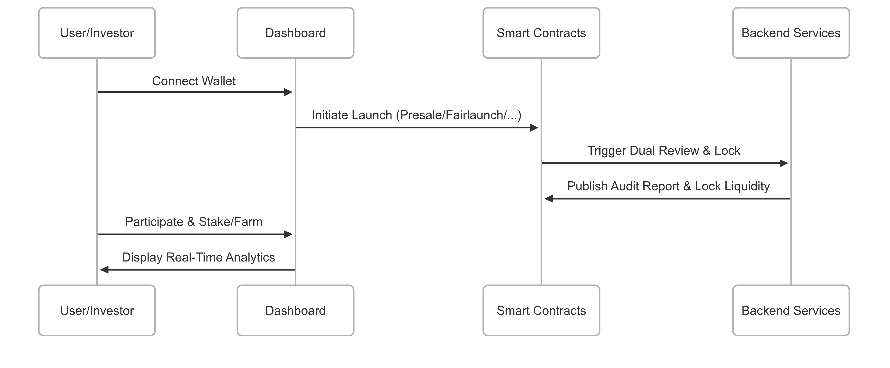

# 5.Solution Overview

_How OPPAD eliminates risk, centralization, and friction in token launches._

OPPAD is more than just a launchpad — it is a fully modular, no-code, trust-enforced launch **infrastructure protocol**. Every layer is designed to protect investors, empower builders, and fuel long-term on-chain growth.\

***

<figure><figcaption></figcaption></figure>

> \[!INFO]\
> **OPPAD is a decentralized launch system** built with embedded token tools, dual-layer audits, liquidity security, and integrated yield mechanisms — all accessible without coding.

***

#### 🧠 Dual Review System

_Every project undergoes a two-layer review before going live._

* **AegisAI™** — Smart contract scanner detecting common vulnerabilities: reentrancy, overflows, honeypots, etc.
* **Sentinel Review** — Human analysts perform logic review, cross-check libraries, and test deployment risks.

> \[!TIP]\
> Projects receive an audit rating directly on their dashboard card (Verified / Warned / Rejected).

***

#### 🧰 Modular Launch Modes

_OPPAD supports 4 powerful launch types for maximum flexibility._

* **Presale** – Token sales with caps, rates, refund rules, and vesting
* **Fairlaunch** – No whitelist, price discovery by market
* **Stealth Launch** – Secret launch timing with rapid listing
* **O-Pump Mode™** – High-energy, bot-resistant, auto-locking, hyped sale format

> \[!NOTE]\
> Each mode auto-generates token and LP logic — no developer needed.

***

#### 🔐 Trust-Enforced Token Creation

* **No-code smart contract deployment** (ERC20 with custom decimals, fees, tax toggles, etc.)
* **OPPADLock** enforces liquidity lock with time duration and audit visibility
* **Badge System** labels tokens as KYC'd, Audited, or Trusted

***

#### 🔁 Post-Launch Utility

* **Staking** – Lock tokens to earn yield (tierless)
* **NFT Passes** – Access bonuses, partner perks, and DAO tools
* **Farming** – LP and token pools with real-time dashboards
* **Revenue Sharing** – Real utility via participation-based earnings

***

#### 🌐 Multi-Chain, No-Code, Permissionless

* Launch on **Ethereum**, **BSC**, **Base**, **Solana**, and **Sonic**
* Fully **permissionless** launch: anyone can deploy, no gatekeeping
* Built-in **analytics**, **whitelisting**, and **API integrations**

***


With OPPAD, launch takes minutes — not months — and comes with the tools builders need **to grow, not just sell.**

