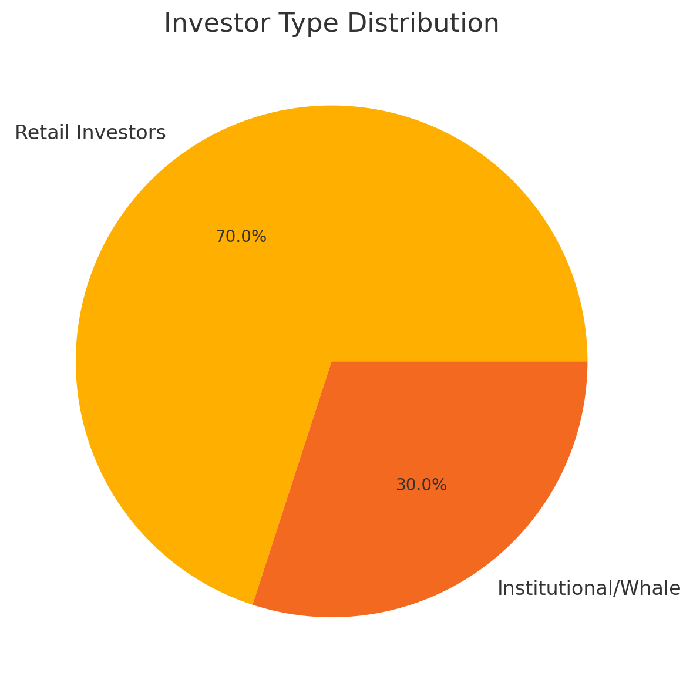
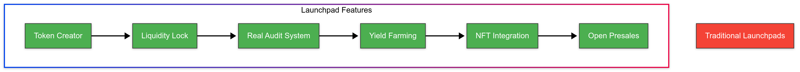
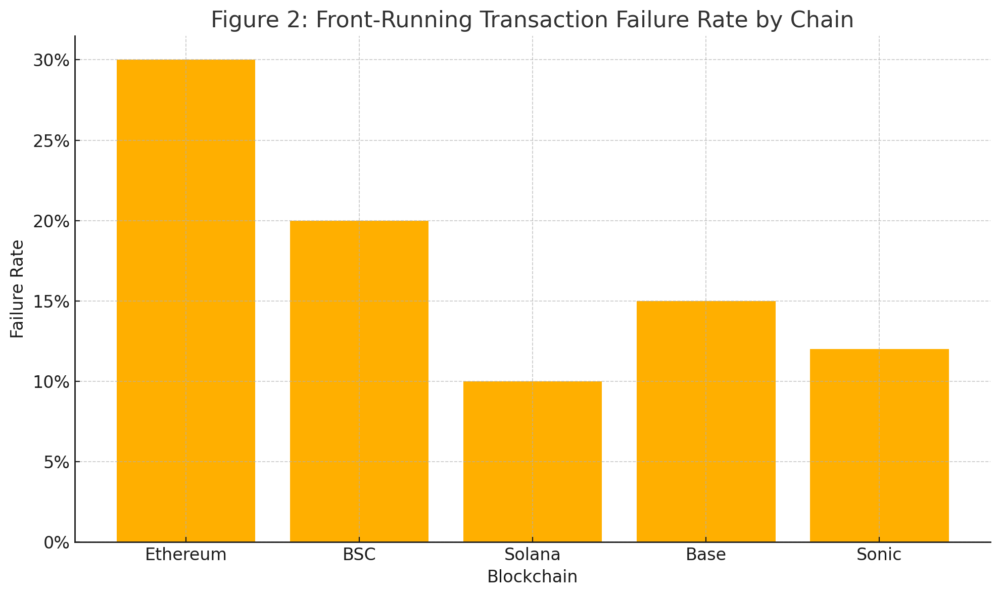

# 3.Market Analysis

The token launch landscape is booming, but it's riddled with risks, outdated models, and centralized friction. As DeFi expands, the demand for **trust-minimized**, **fair**, and **intelligent launch solutions** continues to rise.

***


**Web3 Launch Market Snapshot**

* Over **$80B+ TVL** across DeFi
* **1,000+ new tokens** launched monthly
* Over **50%** lack proper audits or liquidity locks\
  &#xNAN;_(Sources: DefiLlama, REKT Database, Dune Analytics)_


<figure><figcaption></figcaption></figure>

***

#### 💣 Broken Models Still Dominate

Despite the proliferation of launchpads, most platforms still fall short:

* ✅ **One-click token creation** exists
* ❌ But **real auditing** is rare
* ❌ Most use **tier-gated access** favoring early whales
* ❌ No post-launch growth tools (staking, farming, KOL support)
* ❌ Centralized curation, opaque listings

***

<figure><figcaption></figcaption></figure>

> \[!WARNING]\
> A review of over 100 compromised tokens from 2020 to 2023 revealed that **70% had no audit**, and **40% had liquidity removed within 48 hours of launch.**\
> &#xNAN;_&#x53;ource: REKT Leaderboard_

***

#### 📈 OPPAD's Market Fit

| Common Problem           | OPPAD’s Solution                                 |
| ------------------------ | ------------------------------------------------ |
| Fragile Liquidity        | Auto-locks via OPPADLock                         |
| No Audits or Fake Audits | AegisAI™ + Sentinel™ dual review system          |
| Tiered Presales          | Open, tierless access for everyone               |
| Rug Risk                 | Real contract safety checks before launch        |
| Missing Utility          | Built-in farming, staking, and NFT access passes |

***

#### 🌍 Multi-Chain Deployment Focus

<figure><figcaption></figcaption></figure>

OPPAD supports top ecosystems that are driving real user and dev activity:

* 🟦 **Ethereum (ETH)** – DeFi's foundational chain
* 🟨 **BNB Chain (BSC)** – High-volume, retail-friendly
* 🟧 **Base** – Fast-growing, low-fee layer-2
* 🟩 **Solana (SOL)** – High-throughput, meme-driven ecosystem
* 🔴 **Sonic** – Lightweight L1 optimized for experimental, speed-first launches

***


OPPAD isn’t trying to replace current launchpads — it’s leapfrogging them.\
With **no-code tooling**, **tierless access**, **AI + manual audits**, and **built-in yield**, OPPAD introduces the next phase of trust-based launch infrastructure.

