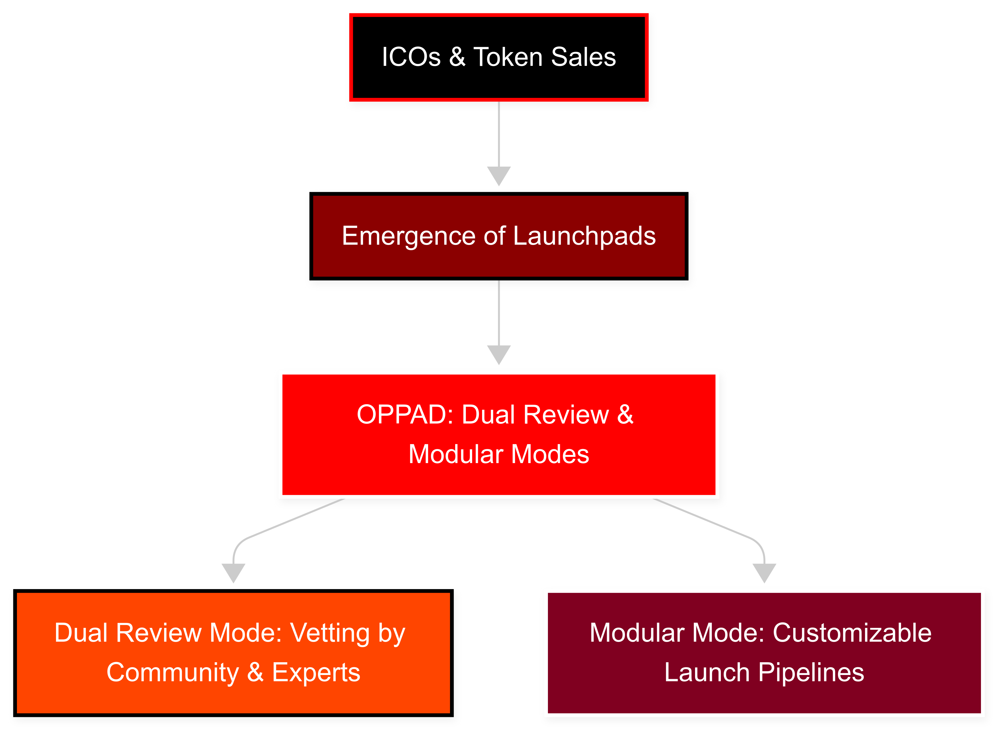

# 4.Problem Statement

_Why existing launchpads are failing both users and builders._

Despite the rise of token launch platforms, **DeFi project launches remain one of the highest-risk areas in Web3**. The lack of transparency, poor security, and centralized control continue to undermine trust and accessibility in early-stage ecosystems.

***


In a decentralized world, most launchpads are still **centralized, unvetted, and gamed by insiders.** The result? Repeated rugpulls, failed launches, and exit scams — all within minutes of going live.


***

#### 🔐 1. **Security Gaps & Fake Audits**

* Many platforms rely on **template contracts** with no real auditing.
* Audit badges are **purchased**, not earned.
* No AI, no manual logic flow checks — just formality.

***

#### 🏃‍♂️ 2. **Unfair Launch Dynamics**

* Launches are dominated by bots or insiders.
* **Tiered access** excludes most retail participants.
* Early buyers dump — retail enters at inflated prices.

***

#### 🕳️ 3. **Liquidity Fragility**

* Without enforced liquidity locking, developers can:
  * Pull the LP
  * Exit with raised funds
  * Leave investors with worthless tokens\
    &#xNAN;_(i.e., rugpulls)_

***


Liquidity locks are not optional — they’re essential. Yet many platforms don’t enforce them. OPPAD changes that.


***

#### 🧪 4. **Poor Developer Onboarding**

* Manual token creation leads to mistakes (wrong decimals, max supply errors).
* Projects must hire third-party devs or risk broken contracts.
* Many platforms don’t support proper vesting, locking, or farming setups.

<figure><figcaption></figcaption></figure>

***

#### 🔄 5. **No Real Post-Launch Utility**

* No staking, no farming, no KOL systems.
* Users buy tokens with **no follow-up engagement**.
* Builders must leave the platform and fend for themselves.

***


OPPAD turns all of these into automated features:\
🔹 Audit + KYC\
🔹 Token + LP locking\
🔹 Utility tools (staking, farming, NFTs)\
🔹 Permissionless, no-code launch flow

